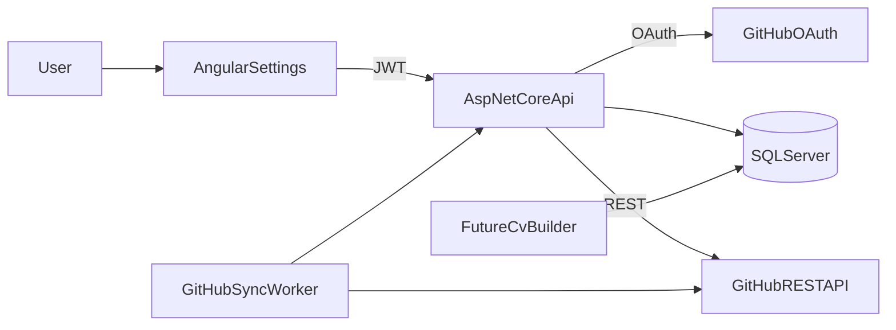

# GitHub Integration Plan

**Related:** [job_search_command_center_roadmap.md](job_search_command_center_roadmap.md) (Phase 4 — portfolio links, resume artifacts) · [OAUTH.md](production-readiness/OAUTH.md) (OAuth patterns) · [hosted_auth_plan.md](hosted_auth_plan.md) (login vs connected accounts)

## Objective

Users connect their GitHub account to ApplyVault. The app syncs their repositories, lets them choose and edit which projects represent them professionally, and (later) uses that curated data when building or tailoring CVs and per-job application artifacts.

GitHub is a **connected account**, not app login. Users continue to authenticate via Supabase; GitHub tokens are stored server-side only.

## Product principles

1. **Curate, don’t dump** — Not every repo belongs on a CV (forks, tutorials, archived repos). Default to opt-in for “include on CV”.
2. **GitHub is source; ApplyVault is presentation** — Sync metadata into the app DB; allow user overrides (`CvTitle`, `CvSummary`) without mutating GitHub.
3. **Reuse existing OAuth patterns** — Mirror calendar/mail connect flows already in the codebase.
4. **Ship in slices** — Each phase delivers standalone value before CV generation exists.

## Target architecture



**Separation of concerns**

| Layer | Responsibility |
|-------|----------------|
| `ConnectedAccounts` | OAuth tokens, GitHub user id, profile email/name |
| `UserGitHubProjects` (new) | Synced repo snapshots + user curation fields |
| Settings UI | Connect, sync, pick projects |
| Future CV feature | Reads curated projects only |

## Reference implementation (existing)

Copy patterns from:

| Concern | Existing reference |
|---------|-------------------|
| OAuth controller | [`CalendarConnectionsController.cs`](../api/ApplyVault.Api/Controllers/CalendarConnectionsController.cs), [`MailConnectionsController.cs`](../api/ApplyVault.Api/Controllers/MailConnectionsController.cs) |
| Connection service | [`CalendarConnectionService`](../api/ApplyVault.Api/Services/CalendarServices.cs), [`MailConnectionService`](../api/ApplyVault.Api/Services/Mail/MailConnectionService.cs) |
| Token storage | [`ConnectedAccountEntity`](../api/ApplyVault.Api/Data/ScrapeResultEntity.cs) |
| OAuth state | Data Protection protector + signed JSON state (calendar/mail) |
| Angular facade | [`CalendarConnectionsFacade`](../frontend/applyvault-jobs-ui/src/app/features/settings/data-access/calendar-connections.facade.ts) |
| Callback route | [`app.routes.ts`](../frontend/applyvault-jobs-ui/src/app/app.routes.ts) → `/integrations/calendar/callback` |
| Background sync | [`MailSyncProcessor`](../api/ApplyVault.Api/Services/Mail/MailSyncProcessor.cs) |

---

## Phase 1 — OAuth connect / disconnect

**Goal:** User can connect and disconnect GitHub from Settings; token stored securely; no repo sync yet.

### 1.1 GitHub OAuth App (manual setup)

Register at GitHub → **Settings → Developer settings → OAuth Apps**.

| Environment | Authorization callback URL |
|-------------|----------------------------|
| Local | `http://localhost:5173/api/github-connections/github/callback` |
| Production | `https://api.<domain>/api/github-connections/github/callback` |

**Scopes (recommended for MVP):**

- `read:user` — profile (login, name, avatar)
- `repo` — read private and public repos (needed if users want private side projects on CV)

Alternative narrow scope: `public_repo` only (document trade-off in UI).

### 1.2 API configuration

Add `GitHubIntegrationOptions` (mirror `CalendarIntegrationOptions`):

```json
"GitHubIntegration": {
  "Enabled": false,
  "PostConnectRedirectUrl": "http://localhost:4200/integrations/github/callback",
  "ClientId": "",
  "ClientSecret": "",
  "RedirectUri": "http://localhost:5173/api/github-connections/github/callback",
  "Scopes": "read:user repo"
}
```

Env vars: `GitHubIntegration__ClientId`, `GitHubIntegration__ClientSecret`, etc.

Extend [`OAuthIntegrationOptionsValidation.cs`](../api/ApplyVault.Api/Infrastructure/OAuthIntegrationOptionsValidation.cs) when `Enabled=true`.

Register in [`ServiceCollectionExtensions.cs`](../api/ApplyVault.Api/Infrastructure/ServiceCollectionExtensions.cs).

### 1.3 API endpoints

`GitHubConnectionsController` at `/api/github-connections`:

| Method | Route | Auth | Purpose |
|--------|-------|------|---------|
| `GET` | `/` | Required | List connected GitHub account(s) for user |
| `POST` | `/github/start` | Required | Return GitHub authorization URL |
| `GET` | `/github/callback` | Anonymous + rate limit | Exchange code, upsert `ConnectedAccount`, redirect |
| `DELETE` | `/{id}` | Required | Disconnect; delete linked projects (Phase 2) |

**Provider constant:** `github` in `ConnectedAccounts.Provider`.

**GitHub provider client responsibilities:**

- Build authorize URL: `https://github.com/login/oauth/authorize`
- Exchange code: `POST https://github.com/login/oauth/access_token`
- Fetch identity: `GET https://api.github.com/user`

Store in `ConnectedAccountEntity`:

- `ProviderUserId` = GitHub numeric user id (string)
- `Email`, `DisplayName` from GitHub profile
- `AccessToken` (GitHub tokens do not expire by default unless app uses expiring tokens)
- `SyncStatus` = `connected` (reuse mail sync status pattern)

### 1.4 Frontend

| File / area | Work |
|-------------|------|
| `github-connections-api.service.ts` | API client |
| `github-connections.facade.ts` | Load/connect/disconnect state |
| `user-settings-page` | GitHub section: Connect / Disconnect, connection status |
| `github-connect-callback.component` | Handle `?provider=github&success=true` |
| `app.routes.ts` | Route `/integrations/github/callback` |

Update Settings subtitle copy to mention GitHub alongside calendar/mail.

### 1.5 Phase 1 exit criteria

- [ ] Connect flow completes locally without `redirect_uri_mismatch`
- [ ] Disconnect removes `ConnectedAccount` row
- [ ] Access token never exposed to browser
- [ ] OAuth callback uses existing rate-limit policy
- [ ] Feature gated by `GitHubIntegration:Enabled`

---

## Phase 2 — Repository sync and storage

**Goal:** After connect, repos are fetched from GitHub and stored in ApplyVault for listing in Settings.

### 2.1 Database

New entity **`UserGitHubProjectEntity`** (table `UserGitHubProjects`):

| Column | Type | Notes |
|--------|------|-------|
| `Id` | GUID | PK |
| `UserId` | GUID | FK → Users |
| `ConnectedAccountId` | GUID | FK → ConnectedAccounts |
| `ExternalRepoId` | long | GitHub repo id; unique per user |
| `FullName` | string | `owner/name` |
| `Name` | string | Repo name |
| `Description` | string? | GitHub description |
| `HtmlUrl` | string | Link for CV |
| `DefaultBranch` | string? | |
| `PrimaryLanguage` | string? | GitHub `language` field |
| `Topics` | string? | JSON array |
| `IsFork` | bool | |
| `IsArchived` | bool | |
| `IsPrivate` | bool | |
| `StarCount` | int | Optional |
| `RepoCreatedAt` | datetimeoffset | From GitHub |
| `PushedAt` | datetimeoffset? | Last activity |
| `LastSyncedAt` | datetimeoffset | |
| `IsActive` | bool | false when removed from GitHub |
| `IncludeOnCv` | bool | Default `false` |
| `CvTitle` | string? | User override |
| `CvSummary` | string? | User override |
| `SortOrder` | int? | User ordering |
| `CreatedAt` / `UpdatedAt` | datetimeoffset | |

**Indexes:**

- Unique: `(UserId, ExternalRepoId)`
- Index: `(UserId, IncludeOnCv)`

Add EF migration via existing migration workflow ([`prod-05-database-and-migrations.md`](production-readiness/prod-05-database-and-migrations.md)).

### 2.2 GitHub API client

`IGitHubApiClient` (server-side HttpClient):

- `GetUserAsync(accessToken)`
- `ListRepositoriesAsync(accessToken, page, perPage)` — paginate `GET /user/repos?sort=updated&affiliation=owner,collaborator&per_page=100`
- Optional later: `GetReadmeAsync(owner, repo, accessToken)`

Handle GitHub rate limits (`X-RateLimit-*` headers); surface friendly errors in sync status.

### 2.3 Sync service

`IGitHubProjectSyncService`:

1. Resolve user’s GitHub `ConnectedAccount`
2. Paginate all repos
3. Upsert by `ExternalRepoId`
4. Mark repos missing from sync as `IsActive = false` (don’t hard-delete immediately)
5. Update `ConnectedAccount.LastSyncedAt`, `SyncStatus`, `LastSyncError`

**Triggers:**

- Immediately after successful OAuth callback (first sync)
- Manual: `POST /api/github-projects/sync`
- Later (Phase 5): scheduled background job

### 2.4 API endpoints

`GitHubProjectsController` at `/api/github-projects`:

| Method | Route | Purpose |
|--------|-------|---------|
| `GET` | `/` | List synced projects (query: `activeOnly`, `includeOnCvOnly`) |
| `POST` | `/sync` | Trigger sync for current user |
| `GET` | `/{id}` | Single project detail |

DTOs should not expose raw access tokens.

### 2.5 Frontend

Extend Settings GitHub section:

- “Sync now” button
- Last synced timestamp / sync error banner
- Project table: name, language, updated, fork/archived badges
- Default filter: hide forks and archived (toggle to show)

### 2.6 Phase 2 exit criteria

- [ ] Connect triggers initial repo sync
- [ ] Manual sync refreshes list
- [ ] Pagination handles users with 100+ repos
- [ ] Disconnect clears or deactivates linked projects
- [ ] Sync errors visible in Settings (`SyncStatus`, `LastSyncError`)

---

## Phase 3 — Project curation for portfolio / CV prep

**Goal:** User selects which projects matter and edits CV-friendly text before any CV builder exists.

### 3.1 API

| Method | Route | Purpose |
|--------|-------|---------|
| `PATCH` | `/api/github-projects/{id}` | Update `IncludeOnCv`, `CvTitle`, `CvSummary`, `SortOrder` |
| `POST` | `/api/github-projects/reorder` | Batch sort order (optional) |

Validation:

- User must own the project row
- Max lengths for title/summary (e.g. 120 / 500 chars)

### 3.2 Frontend

Per-project row actions:

- Toggle **Include on CV**
- Inline edit title + summary (defaults from repo name/description)
- Drag-to-reorder or up/down controls for included projects
- Preview panel: “How this appears on your portfolio”

Suggested defaults when listing repos:

- `IncludeOnCv = false` for all
- Visual “suggested” badge on non-fork, non-archived repos updated in last 12 months (UI hint only, not auto-include)

### 3.3 Phase 3 exit criteria

- [ ] User can mark projects for CV and persist edits
- [ ] `GET /api/github-projects?includeOnCvOnly=true` returns curated subset
- [ ] Empty state when nothing selected explains next step (future CV)

---

## Phase 4 — CV and job artifact integration (future)

**Goal:** Curated GitHub projects feed resume/portfolio features from [job_search_command_center_roadmap.md](job_search_command_center_roadmap.md) Phase 4.

Not in scope for Phases 1–3 implementation, but design for it now.

### 4.1 Consumption points

- **User profile / portfolio page** — render included projects
- **CV export** — “Projects” section from `IncludeOnCv` rows ordered by `SortOrder`
- **Per-job workspace** — attach subset of portfolio projects to a saved job (new join table later: `JobApplicationProject`)

### 4.2 Mapping to CV fields

| Stored field | CV output |
|--------------|-----------|
| `CvTitle` or `Name` | Project name |
| `CvSummary` or `Description` | Bullet / blurb |
| `PrimaryLanguage`, `Topics` | Tech stack line |
| `PushedAt` / `RepoCreatedAt` | Date range |
| `HtmlUrl` | Portfolio link |

### 4.4 Optional enhancements (later)

- README fetch + AI summary for `CvSummary` suggestion
- Language aggregation across included repos → skills section
- Per-job “tailored project pick list”

### 4.5 Phase 4 exit criteria

- [ ] CV or portfolio view renders curated projects without live GitHub calls
- [ ] User can override GitHub text per project and see it on export

---

## Phase 5 — Production, background sync, and ops

### 5.1 Configuration

Document in [`OAUTH.md`](production-readiness/OAUTH.md):

| Setting | Example |
|---------|---------|
| Callback | `https://api.example.com/api/github-connections/github/callback` |
| Post-connect | `https://app.example.com/integrations/github/callback` |

Separate GitHub OAuth Apps per environment.

Secrets via env vars / user secrets — never commit.

### 5.2 Background sync

Hosted service (similar to mail sync):

- Periodic refresh (e.g. daily) for connected accounts
- Respect GitHub rate limits; backoff on `403` / abuse detection
- Multi-instance safety: consider lease/lock if multiple API instances ([`prod-17-gmail-sync-multi-instance.md`](production-readiness/prod-17-gmail-sync-multi-instance.md) pattern)

### 5.3 Security and compliance

- Encrypt tokens at rest if not already (evaluate `ConnectedAccount.AccessToken` storage)
- On disconnect: delete token + deactivate projects; optional `DELETE /applications/{client_id}/grant` on GitHub
- Log sync failures without logging tokens
- Privacy copy in UI: what repo metadata is stored and why

### 5.4 Observability

- Metrics: connect success/failure, sync duration, repo count, rate-limit hits
- Alerts on repeated sync failures per user

### 5.5 Phase 5 exit criteria

- [ ] Staging/prod OAuth smoke test documented
- [ ] Background sync runs reliably
- [ ] Runbook section for GitHub integration added to deploy docs

---

## Testing strategy

| Area | Approach |
|------|----------|
| OAuth state | Unit test protect/unprotect + provider mismatch |
| Token exchange | Mock `HttpMessageHandler` for GitHub token + user endpoints |
| Sync upsert | Integration test: seed ConnectedAccount, mock repo list, assert DB rows |
| Tenancy | User A cannot read/update User B’s projects |
| Frontend | Facade tests + Settings component smoke (mirror calendar tests) |

Do not call live GitHub in CI.

---

## API contract summary (full feature)

```
GET    /api/github-connections
POST   /api/github-connections/github/start     { returnUrl }
GET    /api/github-connections/github/callback  ?code&state
DELETE /api/github-connections/{id}

GET    /api/github-projects                     ?activeOnly&includeOnCvOnly
POST   /api/github-projects/sync
GET    /api/github-projects/{id}
PATCH  /api/github-projects/{id}                { includeOnCv, cvTitle, cvSummary, sortOrder }
```

---

## Suggested implementation order (PRs)

| PR | Scope |
|----|-------|
| **PR 1** | Options, GitHub OAuth client, connection service, controller, migration not needed yet |
| **PR 2** | Settings connect/disconnect + callback page |
| **PR 3** | `UserGitHubProjects` migration, sync service, list + sync endpoints |
| **PR 4** | Settings project list UI |
| **PR 5** | Curation PATCH + include toggles + reorder |
| **PR 6** | Production config docs + background sync worker |
| **PR 7+** | CV / portfolio consumption (Phase 4) |

---

## Open decisions (resolve before Phase 1 coding)

| Decision | Options | Recommendation |
|----------|---------|----------------|
| Private repos | `repo` vs `public_repo` | `repo` — side projects are often private |
| Org repos | Include collaborator/org repos | MVP: `affiliation=owner` only; expand later |
| Auto-sync frequency | Manual only vs daily | Manual + post-connect for MVP; daily in Phase 5 |
| Delete vs deactivate removed repos | Hard delete vs `IsActive=false` | Deactivate first |
| README ingestion | Phase 2 vs later | Later (Phase 4 AI assist) |

---

## Success metrics

- % of active users with GitHub connected
- Median repos synced per user
- % of synced repos marked `IncludeOnCv`
- Sync error rate
- (Later) CV exports using GitHub-sourced projects
