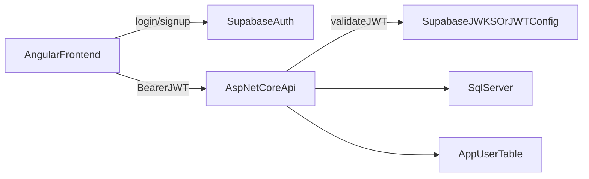

# Hosted Auth Plan

## Recommendation

Use `Supabase Auth` for app login.

Why this is the best fit for your requirements:

- no separate auth server to run
- free tier is generous for an early-stage app
- straightforward Angular integration
- your ASP.NET Core API can validate Supabase JWTs directly
- app login stays separate from Google/Microsoft calendar connections

## Why Not The Others

- `Auth0`: polished, but likely not your best no-cost long-term option
- `Microsoft Entra External ID`: useful, but more Microsoft-centric than you want right now
- `Firebase Auth`: viable, but less natural for your current .NET backend than Supabase
- `Keycloak`: free, but you would have to run and maintain it yourself

## Target Architecture

The important separation is:

- `Supabase Auth` proves who the user is
- your API decides what that user can access in your app
- later, users can optionally connect `Google` or `Microsoft` calendars as separate linked accounts

## Implementation Shape

### 1. Use Supabase for login only

Frontend responsibilities:

- sign up
- sign in
- sign out
- keep session token
- attach access token to API requests

Do not store app business data in Supabase unless you intentionally want that. Keep your app data in your existing SQL Server/API stack.

### 2. Keep your own local user record

Even with hosted auth, create your own `User` table in your app database.

Suggested fields:

- `Id` (your internal GUID)
- `SupabaseUserId` (provider subject / external ID)
- `Email`
- `DisplayName`
- `CreatedAt`
- `LastSeenAt`

This lets your app stay in control of user ownership and makes later provider changes easier.

### 3. Verify JWTs in ASP.NET Core

Configure your API to:

- accept bearer tokens
- validate issuer, audience, expiry, and signature for Supabase JWTs
- read the external user ID from claims
- resolve or auto-create the local app user

Then protect API routes with authorization and scope data by the current user.

### 4. Add ownership to app data

Add `UserId` to user-owned tables such as your scrape results.

That way, queries become:

- return only scrape results for current user
- update only records owned by current user

This is the real multi-user foundation.

### 5. Add optional connected accounts later

When you later add calendar integrations, create a separate table such as `ConnectedAccount`.

Suggested fields:

- `UserId`
- `Provider` (`google` or `microsoft`)
- `ProviderUserId`
- `AccessToken`
- `RefreshToken`
- `ExpiresAt`

This keeps authentication separate from calendar integrations.

## Release Order

1. Set up Supabase project and auth settings.
2. Add Angular login, signup, logout, session restore, and route guarding.
3. Add an HTTP interceptor that sends the Supabase bearer token to the API.
4. Add JWT bearer validation in ASP.NET Core.
5. Create local `User` table and auto-create or resolve the local user from the validated Supabase token.
6. Add `UserId` ownership to scrape results and other user-owned data.
7. Protect API endpoints and filter all reads and writes by current user.
8. Add optional calendar connections later.

## Concrete Phases

### Phase 1: Supabase setup

- Create a Supabase project.
- Enable `email + password` first.
- Configure site URL and redirect URLs for local development and production.
- Keep Supabase limited to authentication only.

### Phase 2: Angular auth flow

- Install Supabase client in the frontend.
- Create an auth service for:
  - sign up
  - sign in
  - sign out
  - current session
  - auth state changes
- Add login and registration screens.
- Guard app routes so unauthenticated users are redirected.
- Add session restore on refresh.

### Phase 3: ASP.NET Core token validation

- Configure JWT bearer authentication in the API.
- Validate Supabase token signature, issuer, and expiry.
- Read claims such as:
  - external user ID from `sub`
  - email when available
- Reject requests without a valid bearer token on protected routes.

### Phase 4: Local app user mapping

- Add a local `User` table in SQL Server.
- On the first authenticated API call:
  - look up the local user by `SupabaseUserId`
  - create the user if it does not exist
- Use the local `User.Id` for all ownership inside your app database.

### Phase 5: User-owned data

- Add `UserId` to `ScrapeResult`.
- Update API reads so they only return the current user's rows.
- Update writes so new rows are created under the current user's `UserId`.
- Update edit/delete logic to require ownership.

### Phase 6: Later integrations

- Keep Google and Microsoft calendar connections separate from login.
- Add connected accounts only after auth and ownership are working end-to-end.

## Practical Notes

- If you ever leave Supabase, your own `User` table and ownership model will reduce migration pain.
- If you want Google or Microsoft sign-in later, Supabase can still act as the front door while calendar integrations remain separate.
- If your app stays small, this setup is much lighter than running Keycloak or building a full identity server yourself.

## Fallback Recommendation

If you later decide you do not want any hosted auth provider at all, the best fallback is `ASP.NET Core Identity` inside your own backend.
