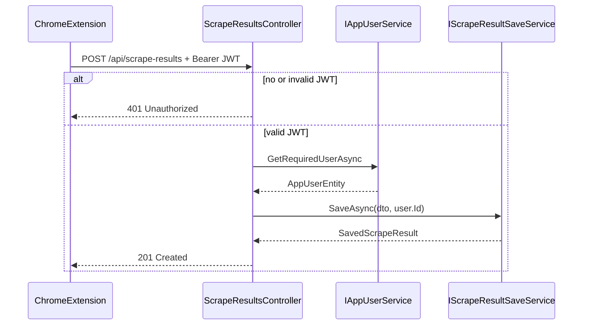

# Step 1 — Scrape Ingest Authentication

**Tracker:** [production-readiness-tracker.md](production-readiness-tracker.md) · **Next step:** [prod-02-tenancy-isolation.md](prod-02-tenancy-isolation.md)

## Problem

`POST /api/scrape-results` is marked `[AllowAnonymous]` while the controller class has `[Authorize]`. The handler uses `TryGetCurrentUserAsync()` and passes `currentUser?.Id` into save, so unauthenticated callers create rows with `UserId == null`. Those rows are visible to all authenticated users (fixed in step 2).

**Affected code:** [ScrapeResultsController.cs](../api/ApplyVault.Api/Controllers/ScrapeResultsController.cs), [IScrapeResultSaveService.cs](../api/ApplyVault.Api/Services/IScrapeResultSaveService.cs).

## Risk

- Unauthenticated spam and AI enrichment cost abuse.
- Orphan rows break multi-tenant isolation.
- Inconsistent authorization model (class-level authorize vs method-level anonymous).

## Prerequisites

- Supabase JWT validation in [Program.cs](../api/ApplyVault.Api/Program.cs) (done — see [hosted_auth_plan.md](hosted_auth_plan.md)).
- Extension sends `Authorization: Bearer` in [aspNetApiClient.ts](../extension/src/infrastructure/api/aspNetApiClient.ts) (done).

## SOLID design

### Single Responsibility (SRP)

| Component | Responsibility |
|-----------|----------------|
| `ScrapeResultsController` | HTTP: validation, status codes, mapping DTOs |
| `IAppUserService` | Map JWT claims → `AppUserEntity` (create-on-first-seen) |
| `IScrapeResultSaveService` | Enrichment + capture quality + persist orchestration |
| `IScrapeResultStore` | Persistence only |

The controller must **not** decide nullable ownership; it always supplies a resolved `userId`.

### Open/Closed (OCP)

- Keep class-level `[Authorize]` on `ScrapeResultsController`.
- OAuth callbacks remain `[AllowAnonymous]` on **other** controllers (`MailConnectionsController`, `CalendarConnectionsController`) — do not copy that pattern to ingest.
- Future ingest policies (scopes, API keys) extend via ASP.NET authorization policies without changing save service logic.

### Liskov Substitution (LSP)

- `GetRequiredUserAsync` throws when unauthenticated; callers must not catch and fall back to anonymous save.
- `SaveAsync(..., Guid userId, ...)` contract: implementors must persist with that user; no silent null.

### Interface Segregation (ISP)

- Controllers depend on `IAppUserService` + `IScrapeResultSaveService`, not `ApplyVaultDbContext`.
- No new fat interface required for this step.

### Dependency Inversion (DIP)

- Controller depends on abstractions (`IAppUserService`, `IScrapeResultSaveService`).
- JWT validation stays in middleware; domain services stay unaware of `HttpContext` except via `IAppUserService`.

## Target behavior

## Implementation checklist

### 1. Controller

- Remove `[AllowAnonymous]` from `Create`.
- Replace `TryGetCurrentUserAsync` + `currentUser?.Id` with `GetRequiredUserAsync` + `user.Id`.
- Align with other actions on the same controller (`GetAll`, `GetById`, etc.).

### 2. Application service contract

- Change `IScrapeResultSaveService.SaveAsync` parameter `Guid? userId` → `Guid userId`.
- Update `ScrapeResultSaveService` implementation.
- `EuresJobSaveService` already passes non-null `userId` from [EuresJobsController](../api/ApplyVault.Api/Controllers/EuresJobsController.cs) — no behavior change.

### 3. Store layer (deferred to step 2)

- `IScrapeResultStore.SaveAsync` may still accept `Guid?` until step 2 migration; controller and save service never pass null after this step.

### 4. Extension / dashboard

- Extension: already requires token before save; 401 surfaces as existing error message.
- Dashboard does not POST scrape results today.

## Production-grade notes

| Topic | Decision |
|-------|----------|
| **401 vs 403** | Missing/invalid JWT → 401 (authentication). Step 2 adds 404 for cross-user access (authorization on resource). |
| **CreatedAtAction** | `GetById` requires auth — consistent for extension refetch. |
| **Long-running save** | Keep `IHostApplicationLifetime.ApplicationStopping` token for enrichment — unchanged. |
| **Rate limiting** | Step 14; not in scope here. |
| **Logging** | Optional: log `userId` + scrape URL at Information on successful create (step 13). |

## Verification

1. `POST /api/scrape-results` without `Authorization` → **401**.
2. `POST` with valid Supabase JWT → **201**, response includes `id` and `savedAt`.
3. New row in DB has **non-null** `UserId` matching JWT `sub` mapped user.
4. Extension scrape-and-save flow still works when signed in.
5. `dotnet test` — existing tests still pass (no controller integration tests until step 3).

## Exit criteria

- No code path from `Create` passes null `userId` to `IScrapeResultSaveService`.
- `[AllowAnonymous]` removed from scrape ingest.
- Tracker step 1 marked **done**.

## Out of scope

- Removing `UserId == null` from queries (step 2).
- Integration tests (step 3).
- Requiring auth on other anonymous endpoints (OAuth callbacks stay anonymous).
