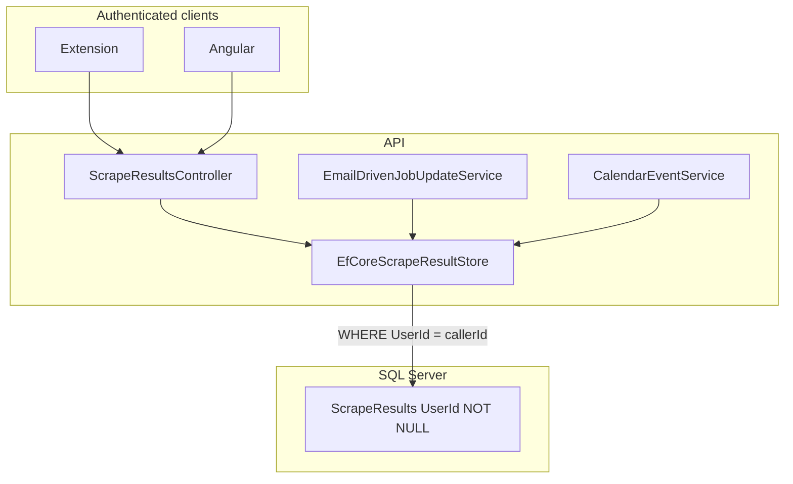

# Step 2 — Multi-Tenant Data Isolation

**Tracker:** [production-readiness-tracker.md](production-readiness-tracker.md) · **Prerequisite:** [prod-01-scrape-ingest-auth.md](prod-01-scrape-ingest-auth.md) (done) · **Next:** [prod-03-api-integration-tests.md](prod-03-api-integration-tests.md)

## Problem

Saved jobs (`ScrapeResultEntity`) can have `UserId == null` from legacy anonymous ingest. Multiple services treat **all null-user rows as visible to every authenticated user**:

```csharp
result.UserId == userId || result.UserId == null
```

That is a **global shared pool** — user A sees user B’s orphans and vice versa.

**Affected files (complete list):**

| File | Occurrences |
|------|-------------|
| [EfCoreScrapeResultStore.cs](../api/ApplyVault.Api/Services/EfCoreScrapeResultStore.cs) | `GetAllAsync`, `GetByIdAsync`, `GetByUrlAsync`, updates, `DeleteAsync` filter |
| [EmailDrivenJobUpdateService.cs](../api/ApplyVault.Api/Services/Mail/EmailDrivenJobUpdateService.cs) | Gmail matcher query |
| [CalendarServices.cs](../api/ApplyVault.Api/Services/CalendarServices.cs) | `SyncEventAsync` scrape lookup |

**Related model/config:**

- [ScrapeResultEntity.cs](../api/ApplyVault.Api/Data/ScrapeResultEntity.cs) — `Guid? UserId`
- [ApplyVaultDbContext.cs](../api/ApplyVault.Api/Data/ApplyVaultDbContext.cs) — `OnDelete(DeleteBehavior.SetNull)` on `UserId` FK (re-creates orphans if user deleted)
- [IScrapeResultStore.cs](../api/ApplyVault.Api/Services/IScrapeResultStore.cs) — `SaveAsync(..., Guid? userId)`

## Risk

| Risk | Impact |
|------|--------|
| Cross-user job visibility | Privacy breach, wrong edits/deletes |
| Gmail sync updates wrong user’s jobs | Status/calendar corruption |
| Calendar events on another user’s scrape | Data leak to external calendar |
| `SetNull` on user delete | Silent re-introduction of null-user rows |

## Prerequisites

- **Step 1 done:** `POST /api/scrape-results` requires JWT; `IScrapeResultSaveService.SaveAsync` uses `Guid userId`.
- No new anonymous ingest path.

## SOLID design

### Single Responsibility (SRP)

| Layer | Tenancy responsibility |
|-------|------------------------|
| **Controller** | Authenticate; pass `user.Id` into services (already true after step 1) |
| **Application services** (mail, calendar) | Operate only on data scoped by `user.Id`; **no** query composition with null fallback |
| **IScrapeResultStore** | **Single place** for scrape-result persistence filters — all methods take `Guid userId` and enforce `result.UserId == userId` |
| **EF migration** | One-time data cleanup; not in runtime request path |

Do **not** add a separate `ITenancyFilter` helper used only in some services — that splits ownership rules and invites drift. Centralize in the store; other services either use the store or duplicate the **same** predicate via a shared internal constant (prefer store methods).

### Open/Closed (OCP)

- Tenancy rule is fixed: `UserId == callerUserId`. Future roles (admin, shared workspace) extend via **new** authorization policies or query objects, not by re-opening `|| UserId == null`.
- EF global query filters (`HasQueryFilter(e => e.UserId == currentUserId)`) are **optional later** — not required for this step; explicit predicates in the store keep behavior obvious and testable.

### Liskov Substitution (LSP)

- `IScrapeResultStore.GetByIdAsync` returns `null` when the row exists but belongs to another user (same as not found). Callers must map to **404**, not 403, to avoid ID enumeration — consistent with current controller behavior.
- `DeleteAsync` returns `false` for wrong owner (no delete of null-user rows by arbitrary users after fix).

### Interface Segregation (ISP)

- Narrow change: only `SaveAsync` signature on `IScrapeResultStore` changes from `Guid?` to `Guid`.
- Mail/calendar services keep their interfaces; only internal queries change.

### Dependency Inversion (DIP)

- Controllers and `ScrapeResultSaveService` depend on `IScrapeResultStore`, not `DbContext`.
- `EmailDrivenJobUpdateService` and `CalendarEventService` today use `DbContext` directly for scrape lookups — **acceptable** if predicates are updated in place; **better** long-term: route through store methods (`GetByIdAsync`, etc.) to avoid duplicated tenancy logic (optional refactor in this step or step 3).

**Recommended for step 2 (minimal):** fix predicates in all three locations.  
**Recommended for step 3:** add integration tests; optionally refactor calendar/mail to use store.

## Target architecture



## Data migration strategy

### Decision: delete orphan rows (recommended for dev/solo)

Orphan rows cannot be attributed to a user. For a local/solo dev database:

1. **Soft-delete** rows where `UserId IS NULL` and `IsDeleted = 0` (set `IsDeleted = 1`), **or** hard-delete if no compliance need.
2. Log count in migration `Up()` via SQL or EF `ExecuteSqlRaw`.

### Alternative: assign to single user (only if exactly one `AppUser`)

If production has orphans and exactly one real user, migration can `UPDATE ScrapeResults SET UserId = @onlyUserId WHERE UserId IS NULL`. Only use when documented and verified.

### Schema migration

1. Data cleanup (above).
2. Alter column `UserId` to `NOT NULL`.
3. Change FK `OnDelete` from `SetNull` → `Restrict` (prevents user delete while jobs exist; forces explicit cascade or manual cleanup) **or** `Cascade` (delete user deletes jobs — document product choice).

**Product recommendation:** `Restrict` + explicit “delete account deletes jobs” flow later.

**Migration file:** `api/ApplyVault.Api/Migrations/YYYYMMDDHHMMSS_EnforceScrapeResultUserOwnership.cs` via `dotnet ef migrations add`.

## Implementation checklist

### 1. Central predicate (store)

Introduce a private static expression or method in `EfCoreScrapeResultStore`:

```csharp
private static bool BelongsToUser(ScrapeResultEntity result, Guid userId) =>
    !result.IsDeleted && result.UserId == userId;
```

Replace every:

```csharp
!result.IsDeleted && (result.UserId == userId || result.UserId == null)
```

with `BelongsToUser(result, userId)` (or inline `result.UserId == userId` with `!result.IsDeleted`).

**Methods to update (8 query sites + Save + Delete):**

- `GetAllAsync`
- `GetByIdAsync`
- `GetByUrlAsync`
- `SaveAsync` — set `UserId = userId` (non-nullable parameter)
- `UpdateCaptureReviewAsync`, `SetRejectedAsync`, `UpdateDescriptionAsync`, `UpsertInterviewEventAsync`, `ClearInterviewEventAsync` — lookup filters
- `DeleteAsync` — replace asymmetric check:

  ```csharp
  // Before: allows delete when UserId is null
  if (entity is null || (entity.UserId != userId && entity.UserId is not null))

  // After
  if (entity is null || entity.UserId != userId)
  ```

### 2. Interface and save pipeline

- [IScrapeResultStore.cs](../api/ApplyVault.Api/Services/IScrapeResultStore.cs): `SaveAsync(..., Guid userId, ...)`
- [EfCoreScrapeResultStore.cs](../api/ApplyVault.Api/Services/EfCoreScrapeResultStore.cs): implement
- [ScrapeResultSaveService.cs](../api/ApplyVault.Api/Services/ScrapeResultSaveService.cs): already passes `Guid` — no change
- [EuresJobSaveService.cs](../api/ApplyVault.Api/Services/Eures/EuresJobSaveService.cs): passes `userId` — no change

### 3. Mail and calendar

- [EmailDrivenJobUpdateService.cs](../api/ApplyVault.Api/Services/Mail/EmailDrivenJobUpdateService.cs) line ~33: `.Where(r => !r.IsDeleted && r.UserId == user.Id)`
- [CalendarServices.cs](../api/ApplyVault.Api/Services/CalendarServices.cs) `SyncEventAsync` lookup: `result.UserId == user.Id` only

### 4. Entity and EF configuration

- [ScrapeResultEntity.cs](../api/ApplyVault.Api/Data/ScrapeResultEntity.cs): `public Guid UserId { get; set; }`
- [ApplyVaultDbContext.cs](../api/ApplyVault.Api/Data/ApplyVaultDbContext.cs):

  ```csharp
  entity.Property((result) => result.UserId).IsRequired();
  entity.HasOne(...)
      .OnDelete(DeleteBehavior.Restrict);
  ```

### 5. EF migration

```bash
dotnet ef migrations add EnforceScrapeResultUserOwnership \
  --project api/ApplyVault.Api/ApplyVault.Api.csproj
```

`Up()` pseudocode:

```sql
-- Prefer soft-delete for audit trail
UPDATE ScrapeResults SET IsDeleted = 1 WHERE UserId IS NULL AND IsDeleted = 0;
-- Then NOT NULL (after no nulls remain, or only soft-deleted nulls left)
ALTER TABLE ScrapeResults ALTER COLUMN UserId uniqueidentifier NOT NULL;
```

Adjust if using hard-delete instead.

### 6. Unit tests (in ApplyVault.Api.Tests)

Add `ScrapeResultTenancyTests.cs` (or extend store tests):

| Test | Assert |
|------|--------|
| `GetAllAsync_returns_only_owned_jobs` | User A does not see user B’s row |
| `GetByIdAsync_returns_null_for_other_users_job` | No cross-read |
| `GetByUrlAsync_does_not_match_other_users_url` | Duplicate URL per user is OK |
| `DeleteAsync_returns_false_for_other_users_job` | No cross-delete |
| `SaveAsync_persists_userId` | Row has correct FK |

Use in-memory or SQLite test DB pattern already used in `EmailDrivenJobUpdateServiceTests` / `EuresJobSaveServiceTests`.

### 7. Documentation

- [production-readiness-tracker.md](production-readiness-tracker.md): step 2 → done
- [README.md](../README.md): production table + remove “legacy null UserId” caveat

## Production-grade notes

| Topic | Decision |
|-------|----------|
| **404 vs 403** | Wrong `id` → `null` from store → controller **404** (no leak that id exists) |
| **Duplicate URL** | `GetByUrlAsync` scoped per user; two users can save same job URL independently |
| **EURES save** | Already passes `userId`; duplicate detection per user |
| **Performance** | Existing index on `UserId` ([ApplyVaultDbContext.cs](../api/ApplyVault.Api/Data/ApplyVaultDbContext.cs)); consider composite `(UserId, IsDeleted)` if lists grow large |
| **GDPR / delete user** | `Restrict` blocks user row delete until jobs removed — document admin script |
| **Rollback** | Migration downgrade risky if NOT NULL applied; backup DB before migrate in staging |

## Verification

1. Grep repo: **zero** matches for `UserId == null` or `UserId is null` in `api/ApplyVault.Api` (except migration SQL comments).
2. Two test users in DB: A saves job, B’s `GET /api/scrape-results` does not include it.
3. B `GET /api/scrape-results/{id}` for A’s id → **404**.
4. Gmail sync only updates A’s jobs when mail belongs to A.
5. `dotnet test api/ApplyVault.Api.Tests` — all green.
6. Fresh DB migrate from empty: `UserId` NOT NULL constraint applies.

## Exit criteria

- Strict per-user isolation on all scrape-result read/write/delete paths.
- No nullable `UserId` on entity or store save contract.
- Legacy orphans handled by migration.
- FK no longer `SetNull` on user delete.
- Tracker step 2 marked **done**.

## Out of scope

- HTTP integration tests (step 3).
- Row-level security in SQL Server.
- Admin “view all users” role.
- Changing Supabase or JWT structure.

## Optional refactor (step 3)

Extract `IScrapeResultStore.GetByIdForUserAsync` usage in `CalendarEventService` instead of raw `dbContext.ScrapeResults` queries so tenancy rules live in one class only.
