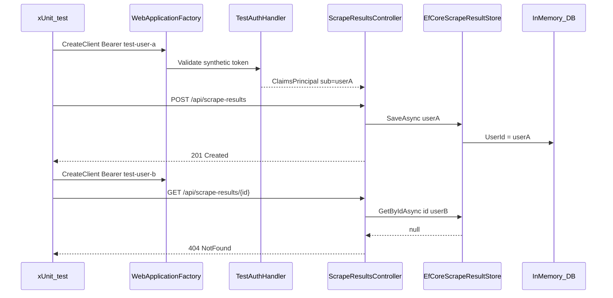

# Step 3 — API Integration Tests (Tenancy)

**Tracker:** [production-readiness-tracker.md](production-readiness-tracker.md) · **Prerequisites:** [prod-01-scrape-ingest-auth.md](prod-01-scrape-ingest-auth.md), [prod-02-tenancy-isolation.md](prod-02-tenancy-isolation.md) · **Next:** [production-readiness/prod-04-api-environment-configuration.md](production-readiness/prod-04-api-environment-configuration.md)

## Problem

Steps 1–2 are enforced in code and covered by **store unit tests** ([`ScrapeResultTenancyTests.cs`](../api/ApplyVault.Api.Tests/ScrapeResultTenancyTests.cs)). There are **no HTTP-level tests** that exercise:

- ASP.NET authentication middleware
- `[Authorize]` on [`ScrapeResultsController`](../api/ApplyVault.Api/Controllers/ScrapeResultsController.cs)
- JSON binding + validation + status codes end-to-end

A future change could break controllers or JWT wiring while store tests still pass.

## Risk

| Risk | Impact |
|------|--------|
| Regress `[AllowAnonymous]` on ingest | Anonymous writes return |
| Broken JWT config in `Program.cs` | 401 for all users or open API |
| Controller passes wrong `userId` | Cross-tenant data at HTTP boundary |
| CI without integration tests | Bugs ship until manual QA |

## Goal

Prove through **`HttpClient`**:

1. `POST /api/scrape-results` without token → **401**
2. `POST` with valid test JWT → **201** + body with `id`
3. User A’s job is **not** in User B’s `GET /api/scrape-results`
4. User B `GET /api/scrape-results/{id}` for User A’s id → **404**

## SOLID design

### Single Responsibility (SRP)

| Type | Responsibility |
|------|----------------|
| `ApplyVaultWebApplicationFactory` | Bootstraps test host: DB, auth, config overrides |
| `TestAuthHandler` | Maps `Bearer test-user-a` → claims (`sub`, `email`) |
| `IntegrationTestScrapeFactory` | Builds valid `ScrapeResultDto` JSON bodies |
| `ScrapeResultsTenancyIntegrationTests` | Assert HTTP status + minimal response shape |
| `Program` (API) | Production composition only; no test logic |

Production [`Program.cs`](../api/ApplyVault.Api/Program.cs) stays thin; test wiring lives only in **`ApplyVault.Api.IntegrationTests`** (separate from unit tests).

### Open/Closed (OCP)

- Extend **`TestUserTokens`** with new static users (`UserC`) without changing factory core.
- Add new test classes per area (`EuresJobsIntegrationTests` in step 6+) without modifying scrape tenancy tests.
- Replace `TestAuthHandler` with certificate-based test auth later by swapping `ConfigureTestServices` — tests depend on `HttpClient` + Bearer, not handler type.

### Liskov Substitution (LSP)

- `WebApplicationFactory<Program>` must produce a host where **production controllers** behave the same regarding 401/404 semantics.
- Test doubles (`IScrapeResultAiClient` no-op) must not change save path ownership — only skip external AI.

### Interface Segregation (ISP)

- Mock **`IScrapeResultAiClient`** only (enrichment off or stub), not entire `IScrapeResultSaveService`.
- Do not replace `IAppUserService` — real implementation must run to prove JWT → `AppUserEntity` mapping.

### Dependency Inversion (DIP)

- Tests depend on HTTP contract, not `EfCoreScrapeResultStore` internals.
- Factory injects abstractions via `ConfigureTestServices`; production DI graph remains default where possible.

## Target architecture



## Implementation checklist

### 1. Expose entry point for `WebApplicationFactory`

Add to API project (new file recommended):

```csharp
// api/ApplyVault.Api/Program.Integration.cs
namespace ApplyVault.Api;

public partial class Program;
```

Required because [`Program.cs`](../api/ApplyVault.Api/Program.cs) uses top-level statements.

### 2. Test project packages

Add to [`ApplyVault.Api.IntegrationTests.csproj`](../api/ApplyVault.Api.IntegrationTests/ApplyVault.Api.IntegrationTests.csproj):

```xml
<PackageReference Include="Microsoft.AspNetCore.Mvc.Testing" Version="10.0.5" />
<PackageReference Include="Microsoft.AspNetCore.TestHost" Version="10.0.5" />
<PackageReference Include="System.IdentityModel.Tokens.Jwt" Version="8.x" />
```

Keep existing **InMemory** EF package (already referenced).

### 3. `ApplyVaultWebApplicationFactory`

Location: `api/ApplyVault.Api.IntegrationTests/ApplyVaultWebApplicationFactory.cs`

**Responsibilities:**

| Override | Behavior |
|----------|----------|
| `ConfigureWebHost` | `UseEnvironment("Development")` |
| `ConfigureTestServices` | See table below |

**Service replacements / config:**

| Service / setting | Test value |
|-------------------|------------|
| `DbContext` | `UseInMemoryDatabase(Guid.NewGuid().ToString("N"))` — **unique DB per factory instance** |
| `ConnectionStrings:ApplyVault` | Dummy (unused when DB replaced) |
| `ScrapeResultEnrichment:Enabled` | `false` — fast, deterministic saves |
| `GoogleAi:Enabled` | `false` |
| `MailIntegration:Enabled` | `false` |
| `GmailMailSyncBackgroundService` | **Remove** `IHostedService` registrations matching that type |
| Authentication | Clear default schemes; add **Test** scheme as default |
| `IScrapeResultAiClient` | Optional stub returning input unchanged |

**Do not** call `Database.Migrate()` in tests — InMemory does not need migrations; ensure factory does not run production migrate block by using replaced DB before host builds, or skip migrate when provider is InMemory (prefer factory-only DB replacement so migrate runs on empty in-memory without SQL scripts failing).

**Recommended:** override `ConfigureWebHost` to set config `ConnectionStrings:ApplyVault` to InMemory and replace `AddDbContext` registration **after** `Program` runs — use `services.RemoveAll<DbContextOptions<ApplyVaultDbContext>>()` pattern or `ConfigureTestServices` with:

```csharp
services.AddDbContext<ApplyVaultDbContext>(o =>
    o.UseInMemoryDatabase(_databaseName));
```

If startup `Migrate()` throws on InMemory, add minimal guard in `Program.cs` **only if needed**:

```csharp
if (!dbContext.Database.IsInMemory()) // EF extension or provider name check
    dbContext.Database.Migrate();
```

Prefer **provider check** via `dbContext.Database.ProviderName.Contains("InMemory")` to avoid prod behavior change.

### 4. `TestAuthHandler`

Location: `api/ApplyVault.Api.Tests/Integration/TestAuthHandler.cs`

- Scheme: `"Test"`
- Authorization header: `Bearer {token}`
- Token map (static):

| Token | `sub` (Supabase user id) | `email` |
|-------|--------------------------|---------|
| `test-user-a` | `11111111-1111-1111-1111-111111111111` | `user-a@test.local` |
| `test-user-b` | `22222222-2222-2222-2222-222222222222` | `user-b@test.local` |

Claims: `sub`, `email`, `name` (optional).  
Set `ClaimsIdentity` authentication type so `IsAuthenticated == true`.

Register in factory:

```csharp
services.AddAuthentication("Test")
    .AddScheme<AuthenticationSchemeOptions, TestAuthHandler>("Test", _ => { });
services.AddAuthorization();
```

**Do not** configure Supabase Authority in test host — avoids network/JWKS.

### 5. `IntegrationTestScrapeFactory`

Build minimal valid [`ScrapeResultDto`](../api/ApplyVault.Api/Models/ScrapeContracts.cs):

- `Title`, `Url`, `Text`, `TextLength`, `ExtractedAt`
- `JobDetails` with required `SourceHostname`, `DetectedPageType`, contacts `[]`
- Unique `Url` per test (`https://example.com/jobs/{guid}`) to avoid duplicate noise

### 6. `ScrapeResultsTenancyIntegrationTests`

Use `IClassFixture<ApplyVaultWebApplicationFactory>` or collection fixture for shared factory.

| Test method | Arrange | Act | Assert |
|-------------|---------|-----|--------|
| `Post_without_token_returns_401` | Client, no header | `POST /api/scrape-results` | `401` |
| `Post_with_valid_token_returns_201` | Bearer `test-user-a` | `POST` valid body | `201`, deserialize `id` |
| `GetAll_does_not_include_other_users_jobs` | A creates job; client B | `GET /api/scrape-results` | B list empty or without A’s id |
| `GetById_for_other_users_job_returns_404` | A creates job; client B | `GET /api/scrape-results/{id}` | `404` |
| `Post_persists_ownership` (optional) | A creates; A lists | `GET` all | Contains created id |

Use `System.Net.Http.Json` (`PostAsJsonAsync`, `ReadFromJsonAsync`).

**Collection fixture:** one factory per test class — new InMemory DB per class is enough; per-test DB if parallelization causes flakes.

### 7. JWT / Supabase production path unchanged

Test host **never** loads real Supabase JWKS. Production [`Program.cs`](../api/ApplyVault.Api/Program.cs) JWT block unchanged when `Environment` is not test — factory sets environment and replaces authentication.

### 8. Files to add (summary)

```
api/ApplyVault.Api/
  Program.Integration.cs          # partial Program

api/ApplyVault.Api.IntegrationTests/
  ApplyVaultWebApplicationFactory.cs
  TestAuthHandler.cs
  TestUserTokens.cs
  IntegrationTestScrapeFactory.cs
  NoOpScrapeResultAiClient.cs
  ScrapeResultsTenancyIntegrationTests.cs

api/ApplyVault.Api.Tests/         # unit tests only (no Mvc.Testing)
```

Optional: `IntegrationCollection.cs` for xUnit collection definition.

## Production-grade notes

| Topic | Decision |
|-------|----------|
| **401 vs 403** | Missing/invalid Bearer → **401** (ASP.NET default for challenge) |
| **404 not 403** | Cross-user id → **404** (no resource enumeration) — matches step 2 store behavior |
| **Determinism** | Enrichment off; no HTTP clients to Google/EURES in these tests |
| **Speed** | InMemory + no hosted sync; target &lt; 5s for full class |
| **CI** | Runs in step 6 pipeline with `dotnet test` (no SQL Server service required) |
| **Flaky tests** | Unique InMemory DB name per factory; unique job URLs |
| **Coverage gap** | EURES/mail/calendar HTTP tests deferred to later steps |

## Verification

```bash
dotnet test api/ApplyVault.Api.IntegrationTests/ApplyVault.Api.IntegrationTests.csproj
```

Manual:

1. All integration tests green locally.
2. Break `GetRequiredUserAsync` temporarily → POST test fails → revert.
3. Grep `UserId == null` in API — still zero (step 2).

## Exit criteria

- Five HTTP tests (minimum four listed) pass reliably.
- `partial Program` committed.
- Test host does not require Supabase or SQL Server.
- Tracker step 3 **done**; README production table updated.

## Out of scope

- Playwright / Angular E2E (step 15).
- EURES search HTTP tests.
- OAuth callback tests.
- Testcontainers SQL Server (optional future; not needed for tenancy).
- Refactoring mail/calendar to use `IScrapeResultStore` (step 2 optional note).

## `Program.cs` migrate guard (if InMemory fails at startup)

When factory boots full `Program`, `Database.Migrate()` may error on InMemory. Guard:

```csharp
if (dbContext.Database.ProviderName is not null &&
    !dbContext.Database.ProviderName.EndsWith("InMemory", StringComparison.Ordinal))
{
    dbContext.Database.Migrate();
}
```

This is a small production-safe change: InMemory only used in tests; prod uses SQL Server and still migrates.

## Relationship to step 2 unit tests

| Layer | File | Proves |
|-------|------|--------|
| Store | `ScrapeResultTenancyTests` | EF queries scoped by `userId` |
| HTTP | `ScrapeResultsTenancyIntegrationTests` | Middleware + controller + auth + JSON |

Keep **both** — complementary, not duplicate.
